

  

<table>
<tr>
<td width="58%" valign="top">
</td>
<td width="42%" align="center" valign="middle">

</td>
</tr>
</table>

<b>Todas están en Crunchyroll con doblaje en español latino ✿ romance, comedia, fantasía y campamento</b>

<table>
<tr>
<td width="25%" align="center" valign="top"></td>
<td width="25%" align="center" valign="top">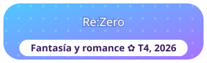</td>
<td width="25%" align="center" valign="top">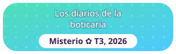</td>
<td width="25%" align="center" valign="top"></td>
</tr>
<tr>
<td width="25%" align="center" valign="top"></td>
<td width="25%" align="center" valign="top"></td>
<td width="25%" align="center" valign="top"></td>
<td width="25%" align="center" valign="top"></td>
</tr>
</table>

<table>
<tr>
<td width="58%" valign="top">

 

La primera vez puede tardar un minuto en abrir porque el servidor gratis se despierta.

</td>
<td width="42%" align="center" valign="top">

<a href="https://github.com/quintillizasyuesugui-svg">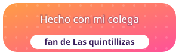</a>
 <b><a href="https://github.com/quintillizasyuesugui-svg">@quintillizasyuesugui-svg</a></b>
</td>
</tr>
</table>

### 🤖 Apps con inteligencia artificial

<a href="https://github.com/nasa-cell/el-resumidor-pdf-"></a>
<a href="https://github.com/nasa-cell/ingles-a-espa-ol-mediante-audio"></a>
<a href="https://github.com/nasa-cell/flores-iris"></a>
<a href="https://github.com/nasa-cell/FINANZAS"></a>

### 🎮 Juegos educativos

<a href="https://nasa-cell.github.io/fracciones/"></a>
<a href="https://nasa-cell.github.io/juego-de-la-multiplicaci-n/">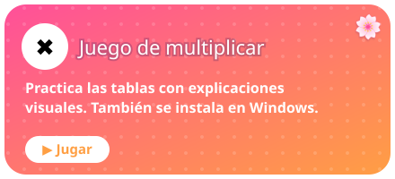</a>
<a href="https://nasa-cell.github.io/suma-y-resta-juego-educativo/">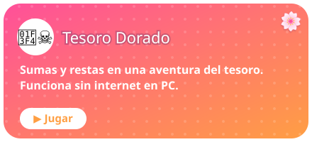</a>
<a href="https://nasa-cell.github.io/la-independencia-del-peru-juego-/"></a>
<a href="https://nasa-cell.github.io/geometr-a-de-las-figuras/"></a>
<a href="https://nasa-cell.github.io/pupiletras-pogreso/"></a>
<a href="https://nasa-cell.github.io/departamentos-del-peru/"></a>
<a href="https://github.com/nasa-cell/porcentaje-juego-educativo-">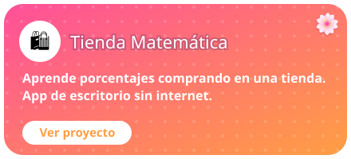</a>

### 🎀 Sistemas y tiendas

<a href="https://github.com/nasa-cell/sistema-de-reportes"></a>
<a href="https://nasa-cell.github.io/Tienda-perritos/">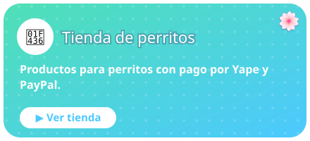</a>

 <b>Yo cuando mi código funciona a la primera ✿</b>
 <a href="https://nasa-cell.github.io/PAGINA-DONDE-MUESTRA-LOS-LINKS-DE-MI-PROYECTOS-/"><b>Ver la página con todos mis proyectos</b></a>

<table>
<tr>
<td width="62%" align="center">

</td>
<td width="38%" align="center">

</td>
</tr>
</table>

