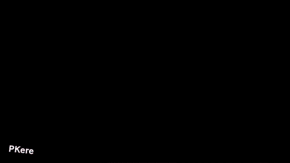
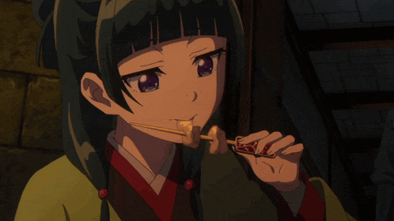
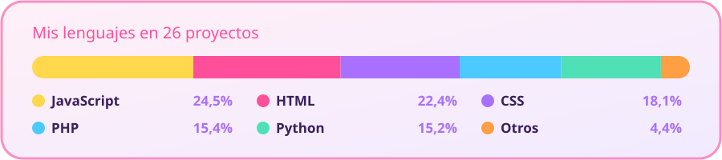
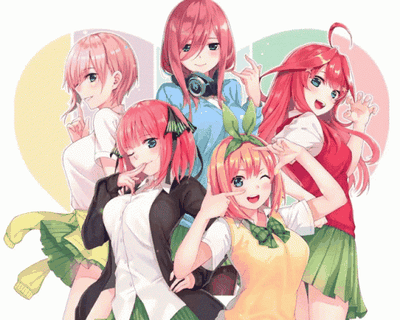

<table>
<tr>
<td width="33%"></td>
<td width="33%"></td>
<td width="33%"></td>
</tr>
<tr>
<td colspan="3" align="center"><b>🏕️ Programar es como acampar: preparas todo con calma y al final disfrutas la vista</b></td>
</tr>
</table>

<table>
<tr>
<td width="58%" valign="top">

🌸 Creo **juegos educativos** para aprender matemáticas, historia y geografía del Perú. Algunos se instalan en Windows y funcionan sin internet.

🤖 Hago **apps con inteligencia artificial**: resúmenes de PDF, traducción por voz y predicciones con redes neuronales.

🎀 También programo **tiendas web** y **sistemas en PHP y MySQL**.

📚 Ahora mismo trabajo en mi **resumidor de PDF** con Gemini.

⭐ Veo anime **doblado al latino** en Crunchyroll y mi plan ideal es un maratón de *Laid-Back Camp* con chocolate caliente.

</td>
<td width="42%" align="center">

 ¡Hola! Gracias por visitar mi perfil
</td>
</tr>
</table>

Todas están en Crunchyroll con doblaje en español latino ✿ romance, comedia, fantasía y campamento

<table>
<tr>
<td width="25%" align="center" valign="top">

 <b>Frieren</b>
 Fantasía ✿ T2, 2026
</td>
<td width="25%" align="center" valign="top">

 <b>Re:Zero</b>
 Fantasía y romance ✿ T4, 2026
</td>
<td width="25%" align="center" valign="top">

 <b>Los diarios de la boticaria</b>
 Misterio y romance ✿ T3, 2026
</td>
<td width="25%" align="center" valign="top">

 <b>Rent-a-Girlfriend</b>
 Comedia romántica ✿ T5, 2026
</td>
</tr>
<tr>
<td width="25%" align="center" valign="top">

 <b>Kaguya-sama: Love is War</b>
 Comedia romántica
</td>
<td width="25%" align="center" valign="top">

 <b>My Dress-Up Darling</b>
 Romance ✿ T2, 2025
</td>
<td width="25%" align="center" valign="top">

 <b>Alya</b>
 Romance y comedia ✿ 2024
</td>
<td width="25%" align="center" valign="top">

 <b>Laid-Back Camp</b>
 Campamento y amistad ✿ T3, 2024
</td>
</tr>
</table>

<table>
<tr>
<td width="62%" valign="top">

**Conexiones** es una presentación interactiva: una pantalla muestra las diapositivas y tú las manejas desde el celular.

- 📱 **Control remoto**: anterior, siguiente, pantalla completa y voz. Abre el control escaneando un código QR.
- 📄 **Sube documentos**: cada página de un PDF, Word, Excel o PowerPoint se convierte en una diapositiva.
- 🔐 **Cuentas con PIN cifrado**: cada persona ve solo sus documentos.
- 🚀 **Aguanta 400 usuarios a la vez**. Si el servidor se reinicia, sigue donde se quedó.
- 🐳 Funciona con **Node.js, Docker y Postgres**, publicada gratis en Render.

**[✿ Abrir Conexiones](https://presentacion-56.onrender.com)** ✿ **[Ver el código](https://github.com/quintillizasyuesugui-svg/presentacion-56)**
 La primera vez puede tardar un minuto en abrir porque el servidor gratis se despierta.

</td>
<td width="38%" align="center">

 🤝 Hecho en equipo con mi colega
 <b><a href="https://github.com/quintillizasyuesugui-svg">@quintillizasyuesugui-svg</a></b>
 fan de <i>Las quintillizas</i>
</td>
</tr>
</table>

<a href="https://nasa-cell.github.io/PAGINA-DONDE-MUESTRA-LOS-LINKS-DE-MI-PROYECTOS-/"><b>✿ Ver la página con todos mis proyectos ✿</b></a>

### 🤖 Apps con inteligencia artificial

<table>
<tr>
<td width="50%" valign="top">
📄 <b><a href="https://github.com/nasa-cell/el-resumidor-pdf-">Resumidor de PDF</a></b>
 Lee el PDF entero, con texto e imágenes, y te devuelve un resumen claro. Hecho en Python con Gemini, gratis.
</td>
<td width="50%" valign="top">
🎙️ <b><a href="https://github.com/nasa-cell/ingles-a-espa-ol-mediante-audio">Traductor por voz</a></b>
 Hablas en español y lo dice en inglés en voz alta. Traduce con un modelo local, sin APIs de pago. Tiene instalador para Windows.
</td>
</tr>
<tr>
<td width="50%" valign="top">
🌷 <b><a href="https://github.com/nasa-cell/flores-iris">Clasificador de flores Iris</a></b>
 Con 4 medidas de la flor adivina su especie. Usa una red neuronal de Keras servida con Flask.
</td>
<td width="50%" valign="top">
📈 <b><a href="https://github.com/nasa-cell/FINANZAS">Predicción financiera</a></b>
 Panel web que predice precios con machine learning y deep learning, analiza noticias y genera informes en PDF.
</td>
</tr>
</table>

### 🎮 Juegos educativos

<table>
<tr>
<td width="50%" valign="top">
🍰 <b><a href="https://github.com/nasa-cell/fracciones">Fracciones Master</a></b> ✿ <a href="https://nasa-cell.github.io/fracciones/">Jugar</a>
 Suma, resta, multiplica y divide fracciones con vidas, puntos y tres niveles.
</td>
<td width="50%" valign="top">
✖️ <b><a href="https://github.com/nasa-cell/juego-de-la-multiplicaci-n">Juego de la multiplicación</a></b> ✿ <a href="https://nasa-cell.github.io/juego-de-la-multiplicaci-n/">Jugar</a>
 Practica las tablas con explicaciones visuales. También se instala en Windows.
</td>
</tr>
<tr>
<td width="50%" valign="top">
🏴‍☠️ <b><a href="https://github.com/nasa-cell/suma-y-resta-juego-educativo">Desafío del Tesoro Dorado</a></b> ✿ <a href="https://nasa-cell.github.io/suma-y-resta-juego-educativo/">Jugar</a>
 Sumas y restas en una aventura del tesoro. Funciona sin internet en PC.
</td>
<td width="50%" valign="top">
🇵🇪 <b><a href="https://github.com/nasa-cell/la-independencia-del-peru-juego-">Hatun Aventuras Heroicas</a></b> ✿ <a href="https://nasa-cell.github.io/la-independencia-del-peru-juego-/">Jugar</a>
 La independencia del Perú hecha juego, con registro de alumnos y seguimiento de su progreso.
</td>
</tr>
<tr>
<td width="50%" valign="top">
🪐 <b><a href="https://github.com/nasa-cell/geometr-a-de-las-figuras">Geometría de las figuras</a></b> ✿ <a href="https://nasa-cell.github.io/geometr-a-de-las-figuras/">Jugar</a>
 Viaja por planetas y gana batallas respondiendo preguntas sobre figuras.
</td>
<td width="50%" valign="top">
🔤 <b><a href="https://github.com/nasa-cell/pupiletras-pogreso">Sopa de letras educativa</a></b> ✿ <a href="https://nasa-cell.github.io/pupiletras-pogreso/">Ver</a>
 Pupiletras escolar hecho con PHP y MySQL en arquitectura MVC.
</td>
</tr>
<tr>
<td width="50%" valign="top">
🗺️ <b><a href="https://github.com/nasa-cell/departamentos-del-peru">Departamentos del Perú</a></b> ✿ <a href="https://nasa-cell.github.io/departamentos-del-peru/">Jugar</a>
 Aprende el mapa del Perú jugando.
</td>
<td width="50%" valign="top">
🛍️ <b><a href="https://github.com/nasa-cell/porcentaje-juego-educativo-">Tienda Matemática</a></b>
 Aprende porcentajes comprando en una tienda. App de escritorio que funciona sin internet.
</td>
</tr>
</table>

### 🎀 Sistemas y tiendas

<table>
<tr>
<td width="38%" align="center" rowspan="2">

 Yo cuando mi código funciona a la primera
</td>
<td width="62%" valign="top">
📊 <b><a href="https://github.com/nasa-cell/sistema-de-reportes">Sistema de reportes</a></b>
 Gestión de proyectos y empleados, seguimiento de avances, reportes en PDF y acceso por roles.
</td>
</tr>
<tr>
<td width="62%" valign="top">
🐶 <b><a href="https://github.com/nasa-cell/Tienda-perritos">Tienda de perritos</a></b> ✿ <a href="https://nasa-cell.github.io/Tienda-perritos/">Ver tienda</a>
 Productos para perritos con pago por Yape y PayPal.
</td>
</tr>
</table>

<table>
<tr>
<td width="62%" align="center">

</td>
<td width="38%" align="center">

</td>
</tr>
</table>

